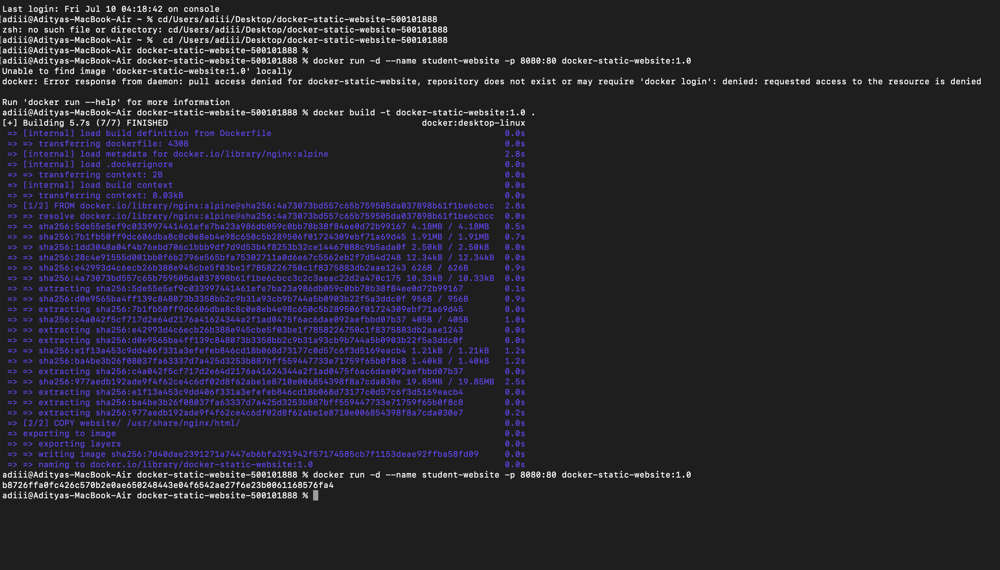
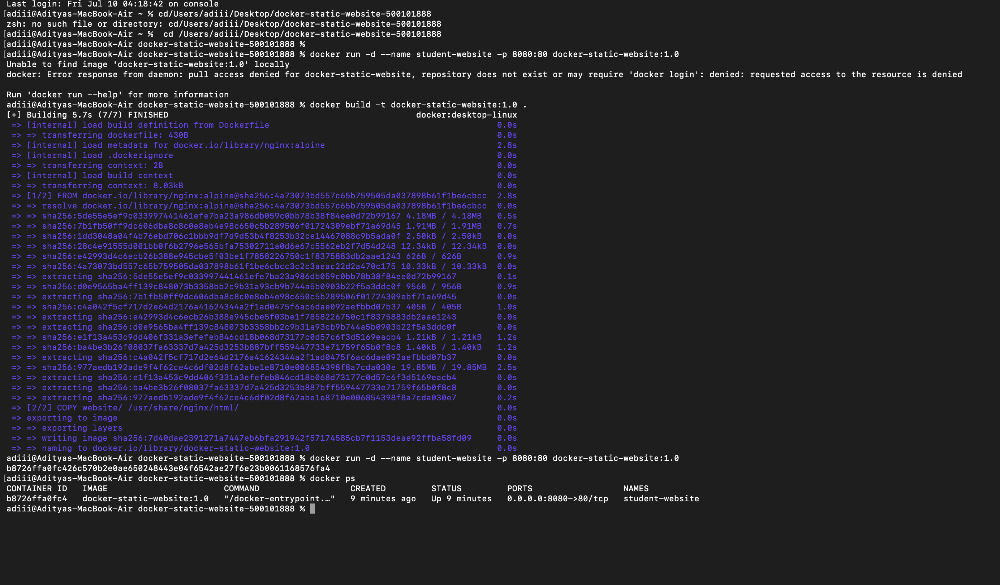
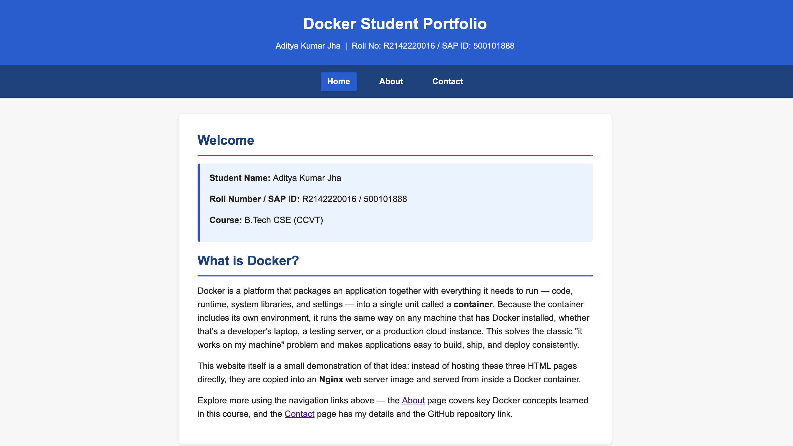
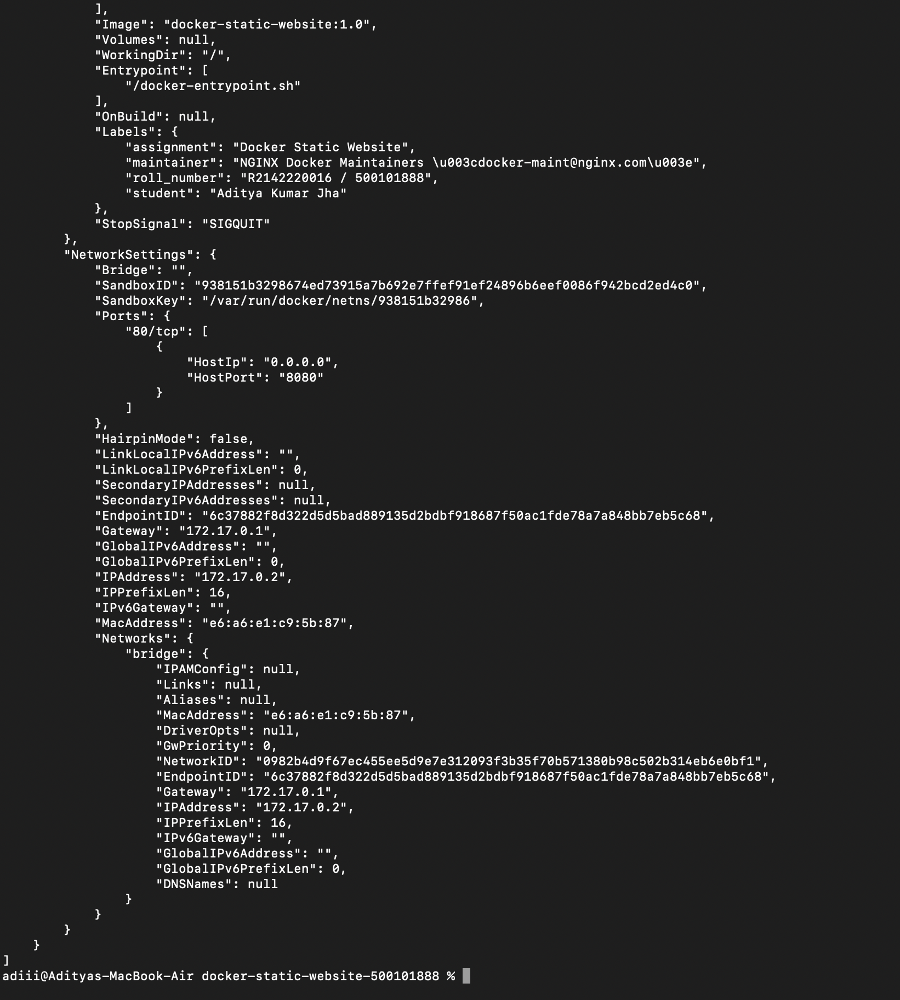

# Remedial Practical Assignment 2 — Dockerize a Static Website

**Student Name:** Aditya Kumar Jha
**Roll Number / SAP ID:** R2142220016 / 500101888
**Course:** B.Tech CSE (CCVT)
**Assignment:** Dockerize a Static Website and Publish the Work on GitHub

---

## 1. Objective

Create a three-page static website, run it inside an Nginx Docker container,
document the process on GitHub, and submit the completed README as a PDF.

---

## 2. Project / Folder Structure

```
docker-static-website-500101888/
|-- Dockerfile
|-- README.md
|-- website/
|   |-- index.html
|   |-- about.html
|   |-- contact.html
|   `-- style.css
`-- screenshots/
    |-- 01-docker-build.png
    |-- 02-container-running.png
    |-- 03-home-page.png
    `-- 04-docker-inspect.png
```

- `website/` — the three linked HTML pages and the shared stylesheet.
- `Dockerfile` — instructions to build an Nginx image that serves the website.
- `screenshots/` — evidence of the build and run process.

---

## 3. The Website

Three linked pages were created:

- **index.html** — title, student details, course name, a short explanation
  of Docker, and links to the other two pages.
- **about.html** — six Docker concepts (Image, Container, Dockerfile, Port
  Mapping, Docker Hub/Base Images, Volumes) each explained in one or two
  sentences.
- **contact.html** — student name, institutional email, GitHub repository
  link, and a statement that the site runs inside a Docker container.
- **style.css** — shared styling (header, navigation bar, content card,
  footer) applied consistently across all three pages.

---

## 4. The Dockerfile

```dockerfile
FROM nginx:alpine

LABEL student="Aditya Kumar Jha"
LABEL roll_number="R2142220016 / 500101888"
LABEL assignment="Docker Static Website"

COPY website/ /usr/share/nginx/html/

EXPOSE 80
```

### Dockerfile Q&A

**1. Why was `nginx:alpine` selected?**
`nginx:alpine` uses Nginx built on the minimal Alpine Linux base image. It is
very small in size (a few MB, compared to full OS-based images), which makes
it faster to download and build, while still providing a production-grade
web server capable of serving static HTML/CSS files out of the box.

**2. What does `COPY` do?**
`COPY website/ /usr/share/nginx/html/` copies the contents of the local
`website/` folder (on the host machine, at build time) into the
`/usr/share/nginx/html/` directory inside the image. This is the default
directory from which Nginx serves web content, so any files placed there
become accessible over HTTP once the container runs.

**3. What is the purpose of `EXPOSE 80`?**
`EXPOSE 80` documents that the container listens on port 80 (Nginx's default
HTTP port) at runtime. It is informational/metadata for anyone reading the
Dockerfile or inspecting the image — it does **not** by itself publish the
port to the host; that is done separately with `-p` when running the
container.

**4. What is the difference between host port 8080 and container port 80?**
Port 80 is the port **inside** the container where Nginx is actually
listening. Port 8080 is the port opened **on the host machine**. The flag
`-p 8080:80` maps host port 8080 to container port 80, so traffic sent to
`http://localhost:8080` on the host is forwarded into the container's port
80. This mapping allows the container's internal port to differ from the
port used to reach it from outside.

---

## 5. Build and Run Commands

```bash
docker --version
docker build -t docker-static-website:1.0 .
docker images
docker run -d --name student-website -p 8080:80 docker-static-website:1.0
docker ps
docker logs student-website
docker inspect student-website
docker exec student-website ls /usr/share/nginx/html
docker stop student-website
docker start student-website
```

Website verified at: **http://localhost:8080**

### Command Q&A

**1. Meaning of `-d`**
Runs the container in **detached mode**, i.e. in the background, so the
terminal is freed up immediately instead of staying attached to the
container's console output.

**2. Purpose of `--name student-website`**
Assigns a fixed, human-readable name (`student-website`) to the container
instead of Docker auto-generating a random one. This makes it easier to
reference the container in later commands (`docker logs`, `docker stop`,
`docker inspect`, etc.).

**3. Meaning of `-p 8080:80`**
Maps port 8080 on the host machine to port 80 inside the container, so
requests to `localhost:8080` reach the Nginx server running inside the
container on port 80.

**4. What `docker ps` displays**
Lists all currently **running** containers, showing information such as
container ID, image used, command, creation time, status, exposed/mapped
ports, and container name. (`docker ps -a` would also show stopped
containers.)

**5. What `docker inspect` is used for**
Returns detailed, low-level configuration and state information about a
container (or image) in JSON format — including network settings, mounted
volumes, environment variables, labels, and the exact command used to start
it. Useful for debugging and verifying configuration.

---

## 6. Screenshots

| Step | Screenshot |
| --- | --- |
| Docker build output |  |
| Container running (`docker ps`) |  |
| Website home page in browser |  |
| `docker inspect` output |  |

---

## 7. Evidence Links

- **GitHub Repository:** https://github.com/adityakumarjha12/docker-static-website-500101888
- **Screen Recording (Google Drive / OneDrive, view access enabled):** PASTE_RECORDING_LINK_HERE

---

## 8. Final Submission Checklist

- [x] Three website pages and CSS file completed
- [x] Dockerfile completed
- [x] Image builds successfully
- [x] Container runs at http://localhost:8080
- [x] Four screenshots included
- [x] README.md completed
- [x] GitHub link included
- [ ] Recording link included and accessible
- [x] README saved as PDF
- [x] PDF named correctly (`Docker_Practical_2_500101888.pdf`) and uploaded to LMS
